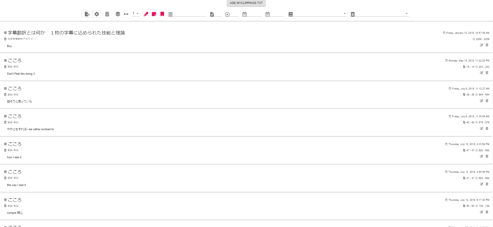

# Kindle Clippings Manager

## Currently supported features
- Filter clippings by content, page, location, date, author, title
- Filter clippings by type: Highlight, Note, Bookmark
- Edit clippings
- Show Highlight and Notes from the same location together
- Export Clippings (naive implementation)
- Remove all visible clippings
- Doesn't import already added and later removed clippings
- Store added clippings in local IndexedDB
- Import books (in progress, currently supports only html books)
- Display highlights in context of book (if imported)

## Goals of this project
Main goal is to be able to export clippings
in a format friendly for reviewing foreign languages words on Kindle.
For example for each highlighted word there
would be a page containing word, translation,
and context taken from a book.

    word
    translation (Japanese only)
    context
    
Context would be sentence that the word is contained in,
or optionally also adjacent sentences.
This feature would require user to upload
a book and their Kindle's serial number to remove DRM from it. 
- Recreate some of clippings viewing functionality that Kindle devices offer 
using only MyClippings.txt file
- Parse MyClippings.txt in multiple languages
- Group Highlights and Notes whose locations overlap
 and show them as one like amazon clippings viewer does
- Show highlights and sentences surrounding it as kindle device shows them
- Export clippings in kindle friendly format
- If highlight is a single word or expression,
 display it's translation 